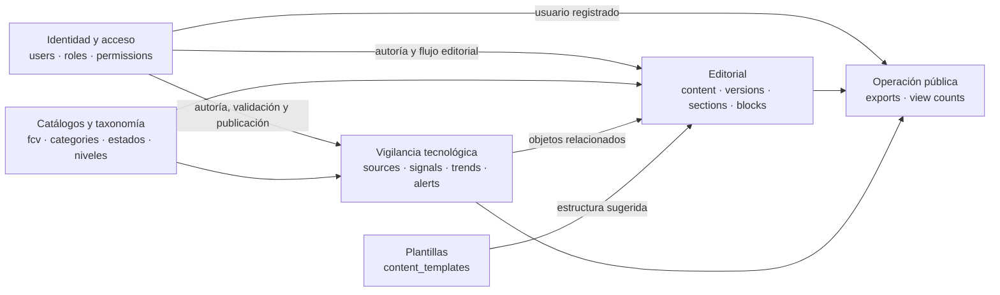
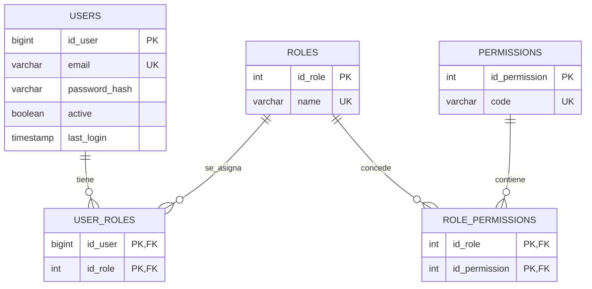
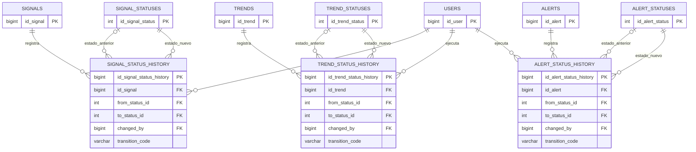
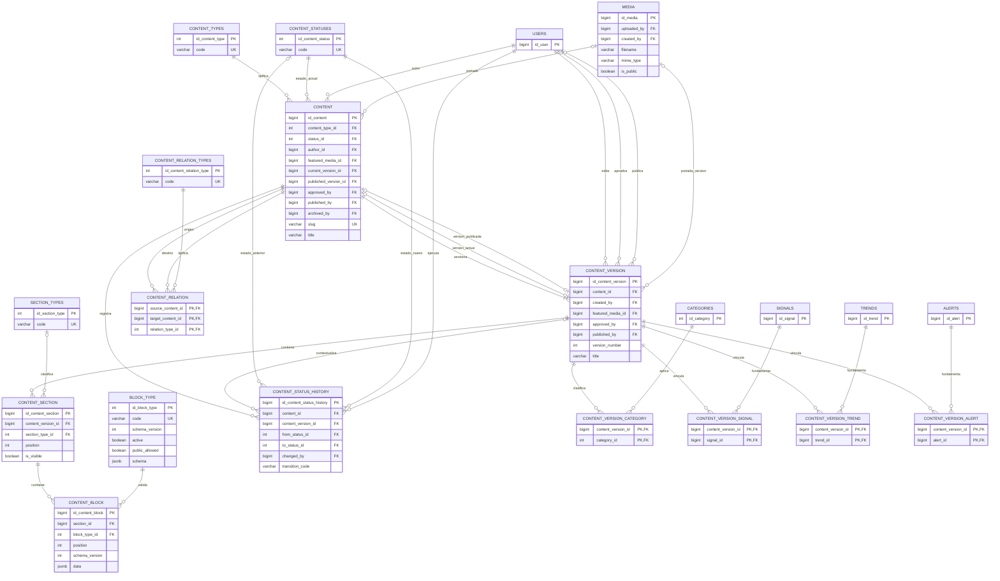
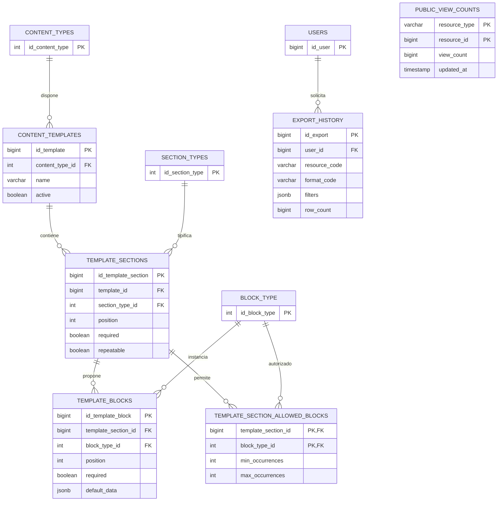

# Modelo entidad-relación del MVP

Este documento reconstruye el esquema efectivo de PostgreSQL a partir de las migraciones `01` a `22`. El modelo se divide por dominios para mantener legibles las relaciones. Los atributos mostrados son claves y campos funcionales principales; las tablas conservan columnas adicionales de auditoría, descripción y configuración.

## Vista general

## 1. Identidad y control de acceso

Los usuarios y roles tienen una relación muchos-a-muchos. Los permisos se asignan a roles, no directamente a usuarios.

## 2. Taxonomía y vigilancia tecnológica

`signals` es el núcleo de captura. Una señal pertenece a una fuente y categoría, recibe clasificaciones que permiten calcular su IPS y puede alimentar múltiples tendencias y alertas. Las tendencias agregan señales y actores; las alertas pueden relacionar señales, tendencias y audiencias simultáneamente.

```mermaid
erDiagram
    FCV {
        int id_fcv PK
        varchar code UK
        varchar name
    }
    CATEGORIES {
        int id_category PK
        int id_fcv FK
        int parent_category_id FK
        varchar name
    }
    SOURCE_TYPES {
        int id_source_type PK
        varchar code UK
    }
    SOURCES {
        bigint id_source PK
        int id_source_type FK
        varchar name
        varchar website
        numeric reliability
        boolean active
    }
    SIGNALS {
        bigint id_signal PK
        varchar business_code UK
        int id_category FK
        bigint id_source FK
        int id_signal_type FK
        int id_impact FK
        int id_urgency FK
        int id_scope FK
        int id_signal_status FK
        int id_reliability FK
        bigint id_analyst FK
        bigint id_validator FK
        numeric ips
        varchar title
    }
    SIGNAL_TYPES {
        int id_signal_type PK
        varchar code UK
    }
    IMPACTS {
        int id_impact PK
        varchar code UK
        numeric weight
    }
    URGENCIES {
        int id_urgency PK
        varchar code UK
        numeric weight
    }
    SCOPES {
        int id_scope PK
        varchar code UK
    }
    RELIABILITY_LEVELS {
        int id_reliability PK
        varchar code UK
        numeric weight
    }
    SIGNAL_STATUSES {
        int id_signal_status PK
        varchar code UK
    }
    KEYWORDS {
        bigint id_keyword PK
        varchar name UK
    }
    SIGNAL_KEYWORDS {
        bigint id_signal PK, FK
        bigint id_keyword PK, FK
    }
    TRENDS {
        bigint id_trend PK
        varchar business_code UK
        int id_trend_direction FK
        int id_trend_maturity FK
        int id_trend_status FK
        bigint id_analyst FK
        bigint id_validator FK
        varchar title
    }
    TREND_DIRECTIONS {
        int id_trend_direction PK
        varchar code UK
    }
    TREND_MATURITY {
        int id_trend_maturity PK
        varchar code UK
    }
    TREND_STATUSES {
        int id_trend_status PK
        varchar code UK
    }
    SIGNAL_TRENDS {
        bigint id_signal PK, FK
        bigint id_trend PK, FK
    }
    ACTOR_TYPES {
        int id_actor_type PK
        varchar code UK
    }
    ACTORS {
        bigint id_actor PK
        int id_actor_type FK
        varchar name
    }
    TREND_ACTORS {
        bigint id_trend PK, FK
        bigint id_actor PK, FK
    }
    ALERTS {
        bigint id_alert PK
        varchar business_code UK
        int id_alert_level FK
        int id_alert_status FK
        int id_alert_origin FK
        bigint id_creator FK
        bigint id_validator FK
        bigint id_publisher FK
        varchar title
    }
    ALERT_LEVELS {
        int id_alert_level PK
        varchar code UK
    }
    ALERT_STATUSES {
        int id_alert_status PK
        varchar code UK
    }
    ALERT_ORIGINS {
        int id_alert_origin PK
        varchar code UK
    }
    ALERT_SIGNALS {
        bigint id_alert PK, FK
        bigint id_signal PK, FK
    }
    ALERT_TRENDS {
        bigint id_alert PK, FK
        bigint id_trend PK, FK
    }
    AUDIENCES {
        int id_audience PK
        varchar code UK
    }
    ALERT_AUDIENCES {
        bigint id_alert PK, FK
        int id_audience PK, FK
    }
    USERS {
        bigint id_user PK
        varchar email UK
    }

    FCV ||--o{ CATEGORIES : agrupa
    CATEGORIES o|--o{ CATEGORIES : categoria_padre
    SOURCE_TYPES ||--o{ SOURCES : clasifica
    SOURCES ||--o{ SIGNALS : sustenta
    CATEGORIES ||--o{ SIGNALS : clasifica
    SIGNAL_TYPES ||--o{ SIGNALS : tipifica
    IMPACTS ||--o{ SIGNALS : pondera
    URGENCIES ||--o{ SIGNALS : pondera
    SCOPES ||--o{ SIGNALS : delimita
    RELIABILITY_LEVELS ||--o{ SIGNALS : pondera
    SIGNAL_STATUSES ||--o{ SIGNALS : estado_actual
    USERS ||--o{ SIGNALS : analiza
    USERS o|--o{ SIGNALS : valida
    SIGNALS ||--o{ SIGNAL_KEYWORDS : etiqueta
    KEYWORDS ||--o{ SIGNAL_KEYWORDS : pertenece

    TREND_DIRECTIONS ||--o{ TRENDS : direccion
    TREND_MATURITY ||--o{ TRENDS : madurez
    TREND_STATUSES ||--o{ TRENDS : estado_actual
    USERS ||--o{ TRENDS : analiza
    USERS o|--o{ TRENDS : valida
    SIGNALS ||--o{ SIGNAL_TRENDS : evidencia
    TRENDS ||--o{ SIGNAL_TRENDS : agrega
    ACTOR_TYPES ||--o{ ACTORS : clasifica
    TRENDS ||--o{ TREND_ACTORS : involucra
    ACTORS ||--o{ TREND_ACTORS : participa

    ALERT_LEVELS ||--o{ ALERTS : severidad
    ALERT_STATUSES ||--o{ ALERTS : estado_actual
    ALERT_ORIGINS ||--o{ ALERTS : origen
    USERS ||--o{ ALERTS : crea
    USERS o|--o{ ALERTS : valida
    USERS o|--o{ ALERTS : publica
    ALERTS ||--o{ ALERT_SIGNALS : incluye
    SIGNALS ||--o{ ALERT_SIGNALS : dispara
    ALERTS ||--o{ ALERT_TRENDS : incluye
    TRENDS ||--o{ ALERT_TRENDS : contextualiza
    ALERTS ||--o{ ALERT_AUDIENCES : dirige
    AUDIENCES ||--o{ ALERT_AUDIENCES : recibe
```

### Historial de estados de vigilancia

Cada agregado conserva su estado actual en la tabla principal y registra cada transición en una tabla de historial con estado anterior, estado nuevo, actor, código de transición, notas y fecha.

## 3. Contenido editorial versionado

`content` identifica la publicación y conserva el estado editorial actual. `content_version` guarda revisiones; cada versión contiene secciones ordenadas y cada sección bloques JSON tipados. `current_version_id` selecciona la revisión de trabajo y `published_version_id` fija la revisión pública inmutable.

### Relaciones editoriales heredadas

El esquema aún conserva `content_category`, `content_signal`, `content_trend` y `content_alert`, que vinculan el contenido sin distinguir versión. La migración `14_editorial_domain.sql` copia esos datos a las tablas `content_version_*`. Para nuevas operaciones, las relaciones versionadas son el modelo más consistente con la publicación inmutable.

## 4. Plantillas, exportaciones y visitas

`public_view_counts` implementa una asociación polimórfica lógica: `(resource_type, resource_id)` puede identificar `content`, `signal`, `trend` o `alert`. No existe una clave foránea física porque un mismo campo puede apuntar a cuatro tablas distintas; la integridad de esa referencia corresponde al servicio de backend.

## Conclusiones del modelo

- El dominio de vigilancia está normalizado mediante catálogos y tablas puente; señales, tendencias y alertas mantienen relaciones muchos-a-muchos sin duplicar entidades.
- La trazabilidad se resuelve con historiales separados para los cuatro flujos con estados: señal, tendencia, alerta y contenido.
- El modelo editorial distingue identidad de publicación y versión. Las secciones, bloques y relaciones temáticas pertenecen a una versión concreta.
- `content.current_version_id` y `content.published_version_id` son claves foráneas compuestas con `id_content`, lo que impide seleccionar una versión perteneciente a otro contenido.
- Las publicaciones ya publicadas se protegen adicionalmente con funciones y triggers; esta regla de inmutabilidad no se aprecia solo mediante cardinalidades.
- Conviene tratar las cuatro tablas `content_*` no versionadas como compatibilidad heredada y evitar que nuevos desarrollos creen dos fuentes de verdad.
- El conteo de visitas es la única relación deliberadamente polimórfica y sin integridad referencial declarativa.

## Fuente analizada

- `database/migrations/01_catalogs.sql` a `database/migrations/22_public_view_counts.sql`.
- Las vistas, procedimientos, índices y triggers se revisaron para interpretar el uso de las relaciones, aunque el diagrama representa principalmente tablas y claves foráneas.
