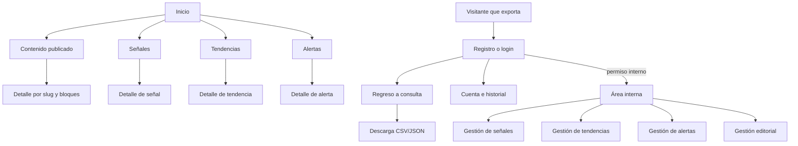
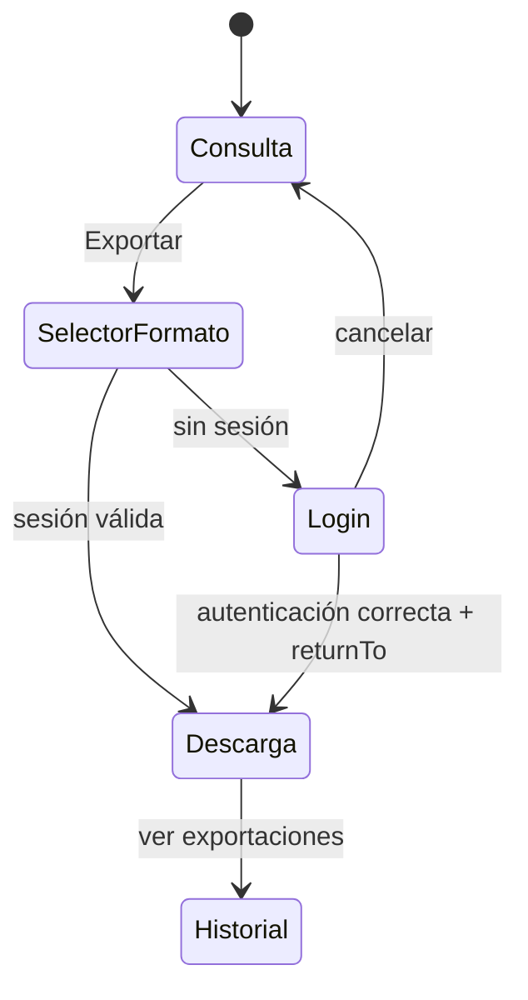

# FE-P0 — Contrato de experiencia y alcance visual

**Fecha:** 13 de julio de 2026

**Estado:** cerrado para iniciar FE-P1

**Contrato de API:** `docs/API-docs/openapi.yaml` 0.5.6

## 1. Propósito

FE-P0 convierte el alcance funcional del backend en decisiones de producto y presentación para que FE-P1 pueda construir una base coherente. Este documento fija la navegación, las rutas, el uso de permisos, los wireframes de referencia, el lenguaje visual, la base técnica, la relación pantalla–API y la estrategia de datos de desarrollo.

Las decisiones son la línea base del MVP. La identidad institucional final —nombre gráfico, logotipo y manual de marca— puede reemplazar los tokens de marca sin cambiar la arquitectura de componentes.

## 2. Audiencias y recorridos

| Audiencia | Objetivo principal | Recorrido mínimo |
| --- | --- | --- |
| Visitante | Consultar conocimiento público | Inicio → colección → filtros → detalle publicado |
| MEMBER | Descargar información pública | Consulta → registro/login → exportación → historial propio |
| ANALYST | Capturar evidencia y análisis | Área interna → crear señal/tendencia/alerta → relacionar → enviar a revisión |
| VALIDATOR | Revisar metodología | Cola interna → detalle e historial → solicitar cambios/validar/activar/cerrar |
| EDITOR | Construir publicaciones | Contenido → crear versión → componer bloques → preview → enviar a revisión |
| PUBLISHER | Aprobar y publicar | Contenido en revisión → preview → aprobar → publicar/archivar |
| ADMIN | Acceso transversal | Mismos módulos gobernados por permisos vigentes |

La interfaz no comparará estos nombres de rol para autorizar. Los roles sólo ayudan a describir recorridos; cada control se decide con permisos obtenidos de `/api/auth/me`.

## 3. Arquitectura de información

### 3.1 Navegación pública

Orden principal:

1. Inicio
2. Boletines
3. Noticias
4. Ecosistema regional
5. Vigilancia tecnológica
6. Publicaciones

`Vigilancia tecnológica` funciona como entrada a señales, tendencias y alertas. `Contenido` permanece como índice transversal y el pie expone además Industria de semiconductores. Esta organización fue ajustada en FE-P2.0 para que la navegación represente los módulos editoriales, sin duplicar renderizadores ni endpoints.

Acciones de cuenta:

- sin sesión: `Iniciar sesión` y `Crear cuenta`;
- con sesión: `Mi cuenta`, `Exportaciones` y `Cerrar sesión`;
- con permisos internos: acceso adicional `Área interna`.

Dashboard, Indicadores, Buscador inteligente, Eventos y Recursos permanecen fuera del shell funcional mientras no exista un contrato de backend. Ecosistema regional e Industria se implementan como páginas editoriales canónicas por `slug` y no requieren un endpoint especializado.

### 3.2 Navegación interna

La navegación lateral se construye por permisos:

| Entrada | Se muestra con cualquiera de estos permisos |
| --- | --- |
| Señales | `signals:read-internal`, `signals:create`, `signals:update-own`, `signals:update-any`, `signals:validate` |
| Tendencias | `trends:read-internal`, `trends:create`, `trends:update`, `trends:validate`, `trends:activate` |
| Alertas | `alerts:read-internal`, `alerts:create`, `alerts:update`, `alerts:validate`, `alerts:publish`, `alerts:close` |
| Contenido | `content:read-internal`, `content:create`, `content:update`, `content:approve`, `content:publish` |

No habrá un dashboard interno ficticio con métricas no respaldadas. `/admin` funcionará inicialmente como índice de los módulos disponibles para el usuario.

### 3.3 Mapa de navegación



## 4. Rutas y responsabilidad

| Ruta | Acceso | Responsabilidad |
| --- | --- | --- |
| `/` | Público | Presentar el propósito y accesos a colecciones disponibles |
| `/contenido` | Público | Listar y filtrar contenido publicado |
| `/contenido/:slug` | Público | Renderizar la versión publicada |
| `/boletines`, `/noticias`, `/publicaciones` | Público | Colecciones editoriales filtradas por tipo |
| `/ecosistema-regional`, `/industria` | Público | Páginas editoriales canónicas por `slug` |
| `/vigilancia` | Público | Entrada modular a señales, tendencias y alertas |
| `/senales`, `/senales/:id` | Público | Explorar señales validadas |
| `/tendencias`, `/tendencias/:id` | Público | Explorar tendencias activas |
| `/alertas`, `/alertas/:id` | Público | Explorar alertas publicadas/cerradas |
| `/registro` | Anónimo | Crear una cuenta MEMBER |
| `/iniciar-sesion` | Anónimo | Obtener una sesión y volver a la ruta de origen |
| `/cuenta` | Autenticado | Mostrar perfil, roles y capacidades |
| `/cuenta/exportaciones` | `exports:download` | Consultar el historial propio |
| `/admin` | Algún permiso interno | Índice de módulos autorizados |
| `/admin/senales/*` | Permisos de señales | Lista, creación, detalle, edición, historial y transiciones |
| `/admin/tendencias/*` | Permisos de tendencias | Lista, relaciones, edición, historial y transiciones |
| `/admin/alertas/*` | Permisos de alertas | Lista, evidencias, audiencias, historial y transiciones |
| `/admin/contenido/*` | Permisos de contenido | Lista, versiones, composición, preview y publicación |

## 5. Matriz de acciones por permiso

El componente `Can` ocultará acciones opcionales; `RequirePermission` protegerá páginas completas. El backend seguirá siendo la autoridad final.

| Acción UI | Permiso requerido |
| --- | --- |
| Exportar y descargar medios | `exports:download` |
| Consultar señales internas | `signals:read-internal` |
| Crear señal | `signals:create` |
| Editar señal propia/cualquiera | `signals:update-own` o `signals:update-any` según propiedad |
| Enviar señal | `signals:submit` |
| Validar/reabrir señal | `signals:validate` |
| Archivar señal | `signals:archive` |
| Consultar tendencias internas | `trends:read-internal` |
| Crear/editar tendencia | `trends:create` / `trends:update` |
| Relacionar señales | `trends:link-signals` |
| Enviar/validar/activar/archivar | `trends:submit`, `trends:validate`, `trends:activate`, `trends:archive` |
| Consultar alertas internas | `alerts:read-internal` |
| Crear/editar alerta | `alerts:create` / `alerts:update` |
| Relacionar evidencia y audiencias | `alerts:link-evidence` |
| Enviar/validar/publicar/cerrar | `alerts:submit`, `alerts:validate`, `alerts:publish`, `alerts:close` |
| Consultar contenido interno | `content:read-internal` |
| Crear/editar contenido | `content:create` / `content:update` |
| Enviar/aprobar/publicar/archivar | `content:submit`, `content:approve`, `content:publish`, `content:archive` |

Una respuesta `403` nunca se interpretará como recurso inexistente. La UI mostrará permiso insuficiente y permitirá volver a una ruta válida.

## 6. Wireframes de referencia

Los wireframes fijan jerarquía y comportamiento, no decoración final.

### 6.1 Shell público — escritorio

```text
┌──────────────────────────────────────────────────────────────────────────┐
│ Marca    Inicio  Contenido  Señales  Tendencias  Alertas   [Iniciar]    │
├──────────────────────────────────────────────────────────────────────────┤
│ Breadcrumb opcional                                                     │
│                                                                          │
│ Título de página                                      Acción contextual  │
│ Descripción breve                                                        │
│                                                                          │
│ Filtros / contenido principal                                            │
│                                                                          │
├──────────────────────────────────────────────────────────────────────────┤
│ Pie: alcance, contacto, accesibilidad y navegación                       │
└──────────────────────────────────────────────────────────────────────────┘
```

### 6.2 Shell público — móvil

```text
┌────────────────────────────┐
│ Marca              [Menú]  │
├────────────────────────────┤
│ Título                      │
│ Descripción                 │
│ [Filtros] [Acción]          │
│                             │
│ Contenido en una columna    │
│                             │
├────────────────────────────┤
│ Pie                         │
└────────────────────────────┘
```

El menú móvil será un panel modal con cierre explícito, trampa de foco, tecla Escape y devolución del foco al disparador.

### 6.3 Colección pública

```text
┌──────────────────────────────────────────────────────────────────────────┐
│ Señales                                                                  │
│ Evidencia validada de cambios relevantes                    [Exportar]   │
├───────────────────┬──────────────────────────────────────────────────────┤
│ Buscar            │ 24 resultados                    Orden: Más recientes│
│ FCV               │ ┌──────────────────────────────────────────────────┐ │
│ Categoría         │ │ Título                                           │ │
│ Impacto           │ │ Fecha · Categoría · Prioridad                    │ │
│ Urgencia          │ │ Resumen                                          │ │
│ Fechas            │ └──────────────────────────────────────────────────┘ │
│ [Limpiar]         │ ...                                                  │
│                   │              [Anterior] 1 2 3 [Siguiente]            │
└───────────────────┴──────────────────────────────────────────────────────┘
```

En móvil, los filtros se abren en un diálogo y el botón anuncia la cantidad de filtros activos. Los resultados y filtros viven en la URL.

### 6.4 Detalle editorial público

```text
┌──────────────────────────────────────────────────────────────────────────┐
│ Tipo · Publicado el ...                                      [Exportar]  │
│ Título                                                                    │
│ Resumen                                                                   │
│ Categorías / FCV                                                          │
├──────────────────────────────────────────────────────────────────────────┤
│ Sección                                                                   │
│   heading / paragraph / quote / list / callout / divider                 │
│   table o chart con alternativa accesible                                │
│   tarjeta resuelta de señal, tendencia o alerta                          │
│   imagen o archivo controlado por API                                     │
├──────────────────────────────────────────────────────────────────────────┤
│ Contenido relacionado                                                     │
└──────────────────────────────────────────────────────────────────────────┘
```

### 6.5 Autenticación y retorno a exportación



No se iniciará una descarga automáticamente después del login sin confirmación visible del usuario; se conservarán recurso, formato y filtros para repetir la acción.

### 6.6 Detalle interno de vigilancia

```text
┌──────────────────────────────────────────────────────────────────────────┐
│ Navegación interna │ Señal SIG-...   [Estado]       [Acción permitida ▾]│
│                    ├─────────────────────────────────────────────────────┤
│ Señales            │ Resumen y métricas                                  │
│ Tendencias         │                                                     │
│ Alertas            │ [Datos] [Relaciones] [Historial]                    │
│ Contenido          │                                                     │
│                    │ Formulario o lectura según estado/permisos           │
│                    │                                                     │
│                    │                     [Cancelar] [Guardar cambios]     │
└────────────────────┴─────────────────────────────────────────────────────┘
```

Las transiciones se separan del guardado. Cada una abre confirmación con consecuencias y errores de dominio, y nunca se representa como un simple cambio de `<select>` de estado.

### 6.7 Constructor editorial

```text
┌──────────────────────────────────────────────────────────────────────────┐
│ ← Contenido   Reporte / Versión 2   Cambios sin guardar   [Preview][Save]│
├──────────────────┬───────────────────────────────────┬───────────────────┤
│ Bloques          │ Composición                       │ Propiedades       │
│ Texto            │ ┌ Sección: Resumen        ⋮ ┐    │ Tipo              │
│ Cita             │ │ [Heading]                  │    │ Datos             │
│ Lista            │ │ [Paragraph]                │    │ Presentación      │
│ Tabla            │ │ [Signal card]              │    │ Visibilidad       │
│ Gráfica          │ └────────────────────────────┘    │                   │
│ Referencias      │ [+ Añadir sección]                │ [Aplicar]         │
└──────────────────┴───────────────────────────────────┴───────────────────┘
```

En móvil el constructor usa una vista por pasos: estructura → propiedades → preview. No se intentará comprimir tres paneles en una pantalla estrecha. El primer reordenamiento puede usar botones accesibles “subir/bajar”; drag and drop sólo se añadirá si mantiene una alternativa de teclado.

## 7. Lenguaje visual inicial

### 7.1 Dirección

La interfaz será institucional, técnica y sobria. Debe comunicar evidencia y trazabilidad, no una estética futurista de neón. Se priorizan fondo claro, tipografía legible, densidad moderada, superficies discretas y color reservado para acciones o estados.

No habrá modo oscuro en el primer MVP. Los tokens permitirán incorporarlo después sin codificar colores directamente en componentes.

### 7.2 Tokens de color

| Token | Valor inicial | Uso |
| --- | --- | --- |
| `--color-bg` | `#F6F8FA` | Fondo general |
| `--color-surface` | `#FFFFFF` | Superficies de contenido |
| `--color-text` | `#17202A` | Texto principal |
| `--color-text-muted` | `#52606D` | Texto secundario |
| `--color-border` | `#CBD5E1` | Separadores y controles |
| `--color-primary` | `#0B5E75` | Acción principal y selección |
| `--color-primary-hover` | `#084A5C` | Hover de acción principal |
| `--color-accent-soft` | `#F4D58D` | Avisos o énfasis suave |
| `--color-success` | `#18794E` | Confirmación |
| `--color-danger` | `#B42318` | Error o acción destructiva |

Las combinaciones principales con blanco o texto oscuro superan contraste WCAG AA para texto normal. Estado, prioridad y nivel siempre incluirán texto o icono; el color no será la única señal.

### 7.3 Tipografía y escala

- familia inicial: `system-ui`, `Segoe UI`, sans-serif;
- cuerpo base: 16 px;
- escala: 14, 16, 18, 22, 28, 36 px;
- texto de lectura: ancho máximo aproximado de 70 caracteres;
- pesos: 400, 500 y 700 sólo donde la jerarquía lo requiera;
- altura de línea mínima: 1.5 para cuerpo.

### 7.4 Espacio y geometría

- unidad base: 4 px;
- escala: 4, 8, 12, 16, 24, 32, 48, 64 px;
- radio de controles: 6 px;
- radio de tarjetas: 8 px;
- borde estándar: 1 px;
- sombra sólo para overlays y menús; las tarjetas se separan principalmente con espacio y borde.

### 7.5 Breakpoints de validación

- móvil: 320–767 px;
- tableta: 768–1023 px;
- escritorio: 1024 px o más;
- ancho máximo de contenido: 1200 px;

Los breakpoints son criterios de composición, no dispositivos específicos.

## 8. Patrones transversales

### 8.1 Colecciones

- búsqueda con envío explícito o debounce controlado;
- filtros y orden serializados en `URLSearchParams`;
- conteo de resultados y filtros activos;
- botón “Limpiar filtros” sólo cuando existe alguno;
- paginación con enlaces/botones y anuncio accesible de página;
- skeleton breve en primera carga y conservación de resultados al cambiar página;
- estado vacío distinto de “sin resultados por filtros”.

### 8.2 Formularios

- etiqueta visible, descripción opcional y error asociado por campo;
- validación local compatible con el backend, sin sustituir errores 400/422;
- errores generales en resumen enfocable al inicio del formulario;
- acción primaria al final y nunca sólo por icono;
- aviso al abandonar cambios sin guardar;
- `updatedAt` conservado como dato técnico oculto para concurrencia.

### 8.3 Estados y transiciones

- estado actual como etiqueta textual;
- acciones posibles como verbos: “Enviar a revisión”, “Validar”, “Publicar”;
- confirmación para publicar, cerrar, archivar o descartar cambios;
- historial como secuencia temporal con persona, transición, fecha y notas;
- conflicto 409 con opciones “Recargar versión actual” y “Conservar una copia local”, nunca sobrescritura automática.

### 8.4 Retroalimentación

| Situación | Respuesta UI |
| --- | --- |
| `400 VALIDATION_ERROR` | Errores junto a campos y resumen |
| `401 AUTHENTICATION_REQUIRED` | Limpiar sesión, conservar `returnTo` y abrir login |
| `403 PERMISSION_DENIED` | Mensaje de permiso insuficiente sin ocultar el contexto |
| `404 RESOURCE_NOT_FOUND` | Página de recurso no disponible |
| `409 CONCURRENT_MODIFICATION` | Diálogo de conflicto y recarga controlada |
| `422 DOMAIN_RULE_VIOLATION` | Explicación junto a la acción o transición |
| `500` o red | Mensaje no técnico y opción de reintento |

Los mensajes efímeros complementan, pero no sustituyen, el cambio visible en pantalla.

## 9. Decisiones técnicas cerradas

| Tema | Decisión FE-P0 |
| --- | --- |
| Lenguaje | Migrar el esqueleto a TypeScript en FE-P1.0 |
| Rutas | React Router con layouts anidados y lazy loading por área |
| Estado remoto | TanStack Query |
| Cliente HTTP | `fetch` tipado a partir de OpenAPI; sin Axios inicialmente |
| Tipos | `openapi-typescript` generado desde `docs/API-docs/openapi.yaml` |
| Formularios | React Hook Form + Zod |
| Estilos | CSS Modules, variables CSS y estilos globales mínimos |
| Iconos | `lucide-react`, siempre con etiqueta accesible cuando sean interactivos |
| Markdown | `react-markdown`, sin habilitar HTML crudo |
| Gráficas | Recharts como primera opción, acompañada de alternativa textual/tabular |
| Unitarias | Vitest + React Testing Library |
| API simulada | MSW con fixtures alineados a OpenAPI |
| E2E | Playwright contra el stack Docker |
| Internacionalización | Español como idioma único del MVP; textos centralizados por feature |

### 9.1 Persistencia de sesión

El JWT se guardará en `sessionStorage`, con el perfil en memoria:

1. registro/login recibe token y usuario;
2. el token se guarda sólo para la sesión de la pestaña;
3. al cargar, el cliente llama `/api/auth/me` antes de considerar restaurada la sesión;
4. un `401` elimina el token y conserva la ruta de retorno;
5. cerrar sesión elimina token, caché privada y datos sensibles de formularios.

Esta decisión reduce la persistencia de un bearer token frente a `localStorage`. Una sesión persistente entre reinicios requerirá más adelante cookies HttpOnly o refresh tokens respaldados por backend; no se simulará desde el cliente.

## 10. Matriz pantalla–API

| Pantalla/feature | Operaciones principales |
| --- | --- |
| Salud técnica | `GET /health` |
| Registro/login/sesión | `POST /auth/register`, `POST /auth/login`, `GET /auth/me` |
| Contenido público | `GET /content`, `GET /content/{slug}` |
| Señales públicas | `GET /signals`, `GET /signals/{id}` |
| Tendencias públicas | `GET /trends`, `GET /trends/{id}` |
| Alertas públicas | `GET /alerts`, `GET /alerts/{id}` |
| Formularios | `GET /catalogs`, `GET /catalogs/{catalog}` |
| Medios públicos | `GET /media/{id}`, `GET /media/{id}/download` |
| Exportaciones | `GET /exports/{resource}.{format}`, `GET /exports/history` |
| Señales internas | `/admin/signals`, `/{id}`, `/{id}/transitions`, `/{id}/history`, `/admin/sources` |
| Tendencias internas | `/admin/trends`, relaciones `/signals` y `/actors`, transiciones e historial |
| Alertas internas | `/admin/alerts`, relaciones `/signals`, `/trends`, `/audiences`, transiciones e historial |
| Contenido interno | `/admin/content`, `/{id}`, `/versions`, `/composition`, `/preview`, `/history`, `/transitions` |
| Editor de bloques | `GET /admin/editorial/block-types` |
| Plantillas | `GET /admin/content-templates`, `GET /admin/content-templates/{id}` |

Los paths de esta tabla omiten el prefijo común `/api`. FE-P1 generará los tipos exactos y nombres de operación desde OpenAPI.

## 11. Estrategia de datos y cuentas de desarrollo

FE-P1 y las verticales posteriores necesitan datos deterministas, no registros manuales distintos en cada equipo.

### 11.1 Cuentas

Se preparará una semilla exclusiva de desarrollo/E2E, nunca incluida en producción, con:

- `member-dev@example.com`;
- `analyst-dev@example.com`;
- `validator-dev@example.com`;
- `editor-dev@example.com`;
- `publisher-dev@example.com`;
- `admin-dev@example.com`.

La contraseña procederá de `E2E_PASSWORD` o una variable equivalente. No se documentará una credencial productiva ni se insertarán hashes fijos en migraciones de producción.

### 11.2 Escenarios mínimos

- colecciones vacías y con más de una página;
- señales en `NEW`, `UNDER_REVIEW`, `VALIDATED` y archivadas;
- tendencias con y sin diversidad suficiente, en revisión, validadas y activas;
- alertas incompletas, listas para revisión, publicadas y cerradas;
- contenido DRAFT, en revisión, publicado y con revisión privada posterior;
- un contenido publicado que utilice los trece tipos de bloque;
- referencias válidas y retiradas;
- imagen pública, archivo descargable y medio no público;
- exportaciones previas sólo para una de las cuentas.

### 11.3 Implementación posterior

La semilla debe ser idempotente y vivir fuera de `/docker-entrypoint-initdb.d` productivo, por ejemplo en `database/seeds/development.sql` y un comando explícito. Los fixtures de MSW reutilizarán las mismas formas de datos, pero no sustituirán el E2E con PostgreSQL.

## 12. Dependencias y límites confirmados

1. El selector/cargador de medios de FE-P6.3 depende de una API administrativa todavía inexistente.
2. El build productivo depende de crear `docker/nginx/production.conf`.
3. Las plantillas pueden estar vacías en una base nueva; la UI permitirá crear sin plantilla.
4. No se diseñarán pantallas de administración de usuarios, roles o catálogos porque esos endpoints no forman parte de OpenAPI 0.5.6.
5. `profile:update-own` existe como permiso, pero no hay endpoint de actualización; `/cuenta` será de sólo lectura en esta línea base.

## 13. Criterios de cierre de FE-P0

| Criterio | Resultado |
| --- | --- |
| Mapa público e interno definido | Cumplido |
| Páginas y acciones relacionadas con permisos | Cumplido |
| Wireframes móvil/escritorio de flujos críticos | Cumplido |
| Tokens y reglas visuales iniciales | Cumplido |
| Stack y persistencia de sesión decididos | Cumplido |
| Matriz pantalla–endpoint | Cumplido |
| Estrategia de datos y perfiles | Cumplido |
| Brechas de backend aisladas | Cumplido |

FE-P0 queda cerrado. El siguiente incremento es **FE-P1.0 — Proyecto y calidad**, seguido de **FE-P1.1 — Cliente API**.
