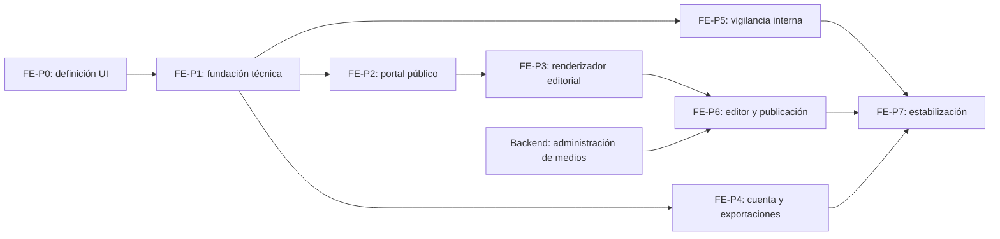

# Plan de implementación del frontend del MVP

**Fecha:** 13 de julio de 2026

**Línea base del backend:** OpenAPI 0.5.6

**Estado inicial:** aplicación React 18 con Vite que únicamente consulta `/api/health`.

## 1. Objetivo

Construir de forma incremental la interfaz pública y los flujos internos del Observatorio de Semiconductores sobre el contrato real del backend. Cada incremento debe terminar en una parte navegable, verificable y documentada, sin depender de módulos futuros que todavía no tienen API.

El primer frontend cubrirá:

- consulta pública de contenido, señales, tendencias y alertas;
- renderizado de contenido editorial basado en bloques;
- registro, inicio de sesión, sesión y exportaciones;
- gestión interna de señales, tendencias y alertas según permisos;
- creación, composición, revisión y publicación editorial;
- estados de carga, vacío, error, permiso insuficiente y concurrencia.

Quedan fuera de este plan hasta que exista dominio y API: indicadores, ecosistema regional, buscador inteligente, ingesta automática, dashboards especializados, worker y Redis.

## 2. Principios de implementación

1. **Contrato primero.** `docs/API-docs/openapi.yaml` es la fuente de verdad para rutas y DTO. No se duplicarán tipos manualmente cuando puedan generarse.
2. **Permisos, no roles.** La navegación y las acciones internas se habilitarán con `user.permissions`.
3. **Estado remoto separado del estado visual.** Las consultas, caché e invalidaciones no se mezclarán con el estado local de formularios y componentes.
4. **URL como estado de consulta.** Filtros, búsqueda, orden y paginación pública deben poder compartirse y recuperarse desde la URL.
5. **Accesibilidad desde el inicio.** Navegación por teclado, foco visible, etiquetas, contraste, semántica y mensajes de error forman parte de cada incremento.
6. **Responsive por defecto.** Se validarán como mínimo vistas móvil, tableta y escritorio.
7. **El backend decide el dominio.** El cliente no calcula IPS, no asigna estados y no reconstruye relaciones o visibilidad pública.
8. **Entrega vertical.** Cada fase incluye UI, consumo real, pruebas y estados alternativos; no se dejarán pantallas conectadas sólo a datos simulados al cerrar un incremento.

## 3. Base técnica recomendada

El cliente actual está prácticamente vacío, por lo que éste es el momento de adoptar una base tipada sin una migración costosa:

- React 18 y Vite;
- TypeScript;
- React Router para rutas y layouts;
- TanStack Query para estado remoto, caché e invalidación;
- `openapi-typescript` y un cliente `fetch` tipado para consumir OpenAPI;
- React Hook Form y Zod para formularios y validación inmediata;
- CSS Modules más variables CSS para tokens visuales;
- Vitest, React Testing Library y MSW para pruebas unitarias e integración;
- Playwright para recorridos E2E contra Docker;
- `react-markdown` con HTML deshabilitado para párrafos Markdown;
- una librería de gráficas que soporte barras, líneas, áreas y pastel cuando se implemente el bloque `chart`.

La selección definitiva y sus versiones se fijarán en FE-P0. Si se decide conservar JavaScript, debe mantenerse la generación o validación de DTO para evitar divergencia con OpenAPI.

## 4. Arquitectura objetivo del cliente

```text
client/src/
├── app/             # providers, router, configuración y sesión
├── api/             # cliente HTTP, tipos generados y errores
├── assets/          # recursos visuales propios
├── components/      # componentes transversales
├── features/        # auth, signals, trends, alerts, content, exports
├── layouts/         # público, cuenta e interno
├── pages/           # composición de páginas por ruta
├── styles/          # tokens, reset y estilos globales
├── test/            # utilidades, MSW y fixtures
└── main.tsx
```

Cada `feature` contendrá sus adaptadores de API, componentes, formularios, hooks y pruebas. Los tipos de respuesta provendrán del contrato; los modelos exclusivos de presentación permanecerán dentro de la característica que los utiliza.

## 5. Mapa inicial de rutas

| Área | Rutas propuestas |
| --- | --- |
| Portal | `/`, `/contenido`, `/contenido/:slug`, `/boletines`, `/noticias`, `/publicaciones`, `/ecosistema-regional`, `/industria` |
| Vigilancia (entrada) | `/vigilancia` |
| Vigilancia pública | `/senales`, `/senales/:id`, `/tendencias`, `/tendencias/:id`, `/alertas`, `/alertas/:id` |
| Cuenta | `/registro`, `/iniciar-sesion`, `/cuenta`, `/cuenta/exportaciones` |
| Señales internas | `/admin/senales`, `/admin/senales/nueva`, `/admin/senales/:id` |
| Tendencias internas | `/admin/tendencias`, `/admin/tendencias/nueva`, `/admin/tendencias/:id` |
| Alertas internas | `/admin/alertas`, `/admin/alertas/nueva`, `/admin/alertas/:id` |
| Editorial | `/admin/contenido`, `/admin/contenido/nuevo`, `/admin/contenido/:id`, `/admin/contenido/:id/editar`, `/admin/contenido/:id/preview` |

Las rutas administrativas compartirán layout, navegación y guardas. Una ruta puede estar disponible para varios perfiles y ocultar acciones puntuales según permisos.

## 6. Secuencia de fases



### FE-P0 — Definición de experiencia y contrato visual

**Estado:** cerrado el 13 de julio de 2026. Véase `docs/frontend-development-logs/MVP-FE-P0-experience-contract.md`.

Esta fase no construye todavía páginas funcionales. Reduce decisiones ambiguas antes de crear componentes.

Entregables:

- mapa de navegación pública e interna;
- inventario de páginas y acciones por permiso;
- wireframes de los flujos críticos en móvil y escritorio;
- tokens iniciales de color, tipografía, espacio, radios y elevación;
- reglas de tablas, formularios, filtros, tarjetas, estados y retroalimentación;
- decisión sobre TypeScript, librerías y persistencia del JWT;
- matriz de DTO/endpoints por pantalla basada en OpenAPI 0.5.6;
- estrategia para datos de desarrollo y cuentas de cada perfil.

Criterio de cierre:

- todas las rutas del primer MVP tienen propósito y audiencia;
- las decisiones visuales permiten implementar sin inventar estilos pantalla por pantalla;
- las brechas de API están identificadas y no se diseñan controles sin backend.

### FE-P1 — Fundación transversal

#### FE-P1.0 — Proyecto y calidad

**Estado:** cerrado el 13 de julio de 2026. Véase `docs/frontend-development-logs/MVP-FE-P1.0-project-quality.md`.

- migrar el esqueleto a TypeScript si se confirma la recomendación;
- configurar alias, ESLint, formateo, pruebas y build;
- crear tokens, reset, tipografía y componentes base mínimos;
- agregar scripts `lint`, `test`, `test:e2e`, `build` y `api:types`.

#### FE-P1.1 — Cliente API

**Estado:** cerrado el 13 de julio de 2026. Véase `docs/frontend-development-logs/MVP-FE-P1.1-api-client.md`.

- generar tipos desde `docs/API-docs/openapi.yaml`;
- cliente con base `/api`, JSON, `FormData` y respuestas binarias;
- normalización de `ApiError` y errores por campo;
- cancelación de solicitudes y manejo uniforme de `401`, `403`, `409` y `422`;
- utilidades de paginación, query strings y descarga.

#### FE-P1.2 — Aplicación y sesión

**Estado:** cerrado el 13 de julio de 2026. Véase `docs/frontend-development-logs/MVP-FE-P1.2-application-session.md`.

- router y layouts público, cuenta e interno;
- providers de consultas y sesión;
- registro, login, restauración mediante `/auth/me` y cierre local;
- componentes `RequireAuth`, `RequirePermission` y `Can`;
- páginas de 404, permiso insuficiente y error inesperado;
- estados comunes de carga, vacío y reintento.

Criterio de cierre:

- una cuenta puede iniciar y restaurar sesión;
- una revocación de permiso se refleja al volver a consultar el perfil;
- las rutas internas no se muestran ni abren sin autorización;
- lint, pruebas y build pasan localmente y en Docker.

### FE-P2 — Portal público de vigilancia

#### FE-P2.0 — Shell público

**Estado:** cerrado el 13 de julio de 2026. Véase `docs/frontend-development-logs/MVP-FE-P2.0-public-shell.md`.

- encabezado, navegación, pie, menú móvil y contenedor de página;
- inicio enfocado en acceso a contenido y vigilancia disponible;
- metadatos básicos de página y jerarquía correcta de encabezados.

#### FE-P2.1 — Señales

**Estado:** cerrado el 13 de julio de 2026. Véase `docs/frontend-development-logs/MVP-FE-P2.1-public-signals.md`.

- listado, búsqueda, filtros, orden y paginación en URL;
- detalle con categoría, FCV, fuente, IPS y relaciones públicas;
- tarjetas y etiquetas reutilizables de prioridad y catálogos.

#### FE-P2.2 — Tendencias y alertas

**Estado:** cerrado el 13 de julio de 2026. Véase docs/frontend-development-logs/MVP-FE-P2.2-public-trends-alerts.md.

- listados y detalles públicos;
- métricas y relaciones devueltas por la API;
- representación accesible de nivel, dirección, madurez, fechas y audiencias;
- navegación cruzada entre entidades públicas disponibles.

#### FE-P2.3 — Índice editorial

**Estado:** cerrado el 13 de julio de 2026. Véase docs/frontend-development-logs/MVP-FE-P2.3-public-content-index.md.

- listado de contenido publicado;
- filtros por tipo, categoría, FCV y fecha;
- tarjetas con medio destacado cuando esté disponible;
- navegación canónica por `slug`.

Criterio de cierre:

- todas las colecciones conservan filtros al recargar y navegar atrás;
- no aparecen controles o campos internos en el portal;
- loading, vacío, error, paginación y responsive están cubiertos por pruebas.

### FE-P3 — Renderizador de contenido editorial

#### FE-P3.0 — Estructura y bloques de texto

**Estado:** cerrado el 13 de julio de 2026. Véase docs/frontend-development-logs/MVP-FE-P3.0-editorial-text-renderer.md.

- secciones, colapsables y ajustes comunes;
- `heading`, `paragraph`, `quote`, `list`, `callout` y `divider`;
- Markdown seguro sin HTML arbitrario.

#### FE-P3.1 — Datos y visualización

**Estado:** cerrado el 13 de julio de 2026. Véase docs/frontend-development-logs/MVP-FE-P3.1-data-visualization.md.

- `table` con estrategia responsive;
- `chart` para barras, líneas, áreas y pastel;
- textos alternativos o tabla equivalente para información gráfica.

#### FE-P3.2 — Referencias y medios

**Estado:** cerrado el 13 de julio de 2026. Véase `docs/frontend-development-logs/MVP-FE-P3.2-references-media.md`.

- `signal`, `trend` y `alert` usando exclusivamente `resolved`;
- variantes `compact`, `card` y `featured`;
- `image` y `file` mediante las URL controladas por la API;
- tolerancia a bloques desconocidos o no resueltos sin romper la página.

Criterio de cierre:

- los trece bloques tienen renderer y pruebas con fixtures del contrato;
- una referencia retirada desaparece o degrada correctamente;
- el detalle público completo funciona sin conocer metadatos editoriales internos.

### FE-P4 — Cuenta registrada y exportaciones

#### FE-P4.0 — Cuenta

**Estado:** cerrado el 13 de julio de 2026. Véase `docs/frontend-development-logs/MVP-FE-P4.0-account.md`.

- registro y login con errores por campo;
- perfil y permisos actuales;
- cierre de sesión local y retorno seguro a la ruta solicitada;
- aviso y recuperación visual ante expiración del JWT.

#### FE-P4.1 — Descargas y exportación

**Estado:** cerrado el 13 de julio de 2026. Véase `docs/frontend-development-logs/MVP-FE-P4.1-exports.md`.

- acciones de exportar en señales, tendencias, alertas y contenido;
- selección CSV/JSON y reutilización de filtros públicos compatibles;
- descarga como `Blob` respetando el nombre de `Content-Disposition`;
- historial propio con filas, tamaño, fecha, formato y checksum;
- solicitud de registro/login al intentar exportar sin sesión.

Criterio de cierre:

- un visitante puede consultar pero no exportar;
- una cuenta MEMBER puede descargar y sólo ve su historial;
- los errores de límite y autorización producen mensajes accionables.

### FE-P5 — Vigilancia interna

#### FE-P5.0 — Patrón administrativo común

**Estado:** cerrado el 13 de julio de 2026. Véase `docs/frontend-development-logs/MVP-FE-P5.0-admin-pattern.md`.

- layout interno y navegación dinámica por permisos;
- tabla administrativa, filtros, panel de detalle e historial;
- formulario reutilizable, confirmaciones y selector de transiciones;
- manejo de `CONCURRENT_MODIFICATION` sin perder silenciosamente datos.

#### FE-P5.1 — Señales

**Estado:** cerrado el 13 de julio de 2026. Véase `docs/frontend-development-logs/MVP-FE-P5.1-signals.md`.

- crear y editar señales permitidas;
- catálogos y palabras clave;
- visualización del IPS calculado por backend;
- enviar, validar, solicitar cambios, reabrir y archivar según permisos.

#### FE-P5.2 — Tendencias

**Estado:** cerrado el 13 de julio de 2026. Incluye la extensión transversal de administración de fuentes. Véase `docs/frontend-development-logs/MVP-FE-P5.2-trends-sources.md`.

- crear y editar tendencias;
- vincular/desvincular señales y actores mientras sea válido;
- mostrar métricas y madurez sugerida sin convertirla automáticamente en decisión;
- revisión, validación, activación y archivo.

#### FE-P5.3 — Alertas

**Estado:** cerrado el 13 de julio de 2026. Véase `docs/frontend-development-logs/MVP-FE-P5.3-alerts.md`.

- crear y editar alertas;
- administrar señales, tendencias y audiencias;
- comunicar requisitos pendientes antes de enviar a revisión;
- validar, publicar y cerrar según permiso.

Criterio de cierre:

- cada perfil ve únicamente las acciones que puede ejecutar;
- la UI respeta estados editables y relaciones permitidas;
- errores 409/422 del dominio se muestran junto a la acción que los causó;
- los tres verticales tienen recorridos E2E principales.

### FE-P6 — Gestión editorial interna

#### FE-P6.0 — Contenido, versiones y flujo

- listado y filtros internos;
- creación con o sin plantilla;
- metadatos, detalle, historial y versiones;
- crear revisión desde una publicación vigente;
- enviar, aprobar, publicar y archivar según permiso.

#### FE-P6.1 — Constructor de composición

- agregar, editar, duplicar, eliminar y reordenar secciones y bloques;
- formularios derivados de los descriptores de `/admin/editorial/block-types`;
- guardado completo de composición con `updatedAt`;
- indicador de cambios sin guardar y recuperación ante conflicto;
- primera entrega con bloques de texto, tabla, gráfica y referencias.

#### FE-P6.2 — Vista previa y publicación

- preview fiel al mismo registro de renderers públicos;
- resumen de validaciones antes de enviar o publicar;
- comparación clara entre versión de trabajo y versión publicada;
- confirmaciones para acciones irreversibles o de alta visibilidad.

#### FE-P6.3 — Medios editoriales

- selector, carga y metadatos de imágenes/archivos;
- integración de `image`, `file` y medio destacado;
- progreso, límites, tipos admitidos y errores de carga.

FE-P6.3 queda bloqueado hasta que el backend exponga la administración de medios. El resto de FE-P6 puede avanzar con referencias existentes y fixtures.

Criterio de cierre:

- editor y publicador completan un ciclo desde borrador hasta publicación;
- la versión publicada no cambia durante una revisión;
- preview y detalle público comparten renderers y no divergen visualmente;
- los conflictos nunca sobrescriben trabajo de forma silenciosa.

### FE-P7 — Estabilización y entrega

- E2E de visitante, MEMBER, ANALYST, VALIDATOR, EDITOR y PUBLISHER;
- auditoría de accesibilidad y navegación por teclado;
- revisión responsive y compatibilidad de navegadores objetivo;
- presupuestos de rendimiento para carga inicial, imágenes y gráficas;
- estados offline/transitorios y reintentos controlados;
- separación de chunks por área y carga diferida de editor/gráficas;
- validación del build productivo detrás de Nginx;
- documentación de operación, pruebas y variables de entorno.

Criterio de cierre:

- lint, unitarias, integración, E2E y build pasan en CI;
- no quedan errores de consola ni rutas sin estado de error;
- los flujos críticos cumplen accesibilidad y responsive acordados;
- Nginx productivo y administración de medios están validados.

## 7. Dependencias paralelas del backend

| Dependencia | Afecta | Estrategia |
| --- | --- | --- |
| API administrativa de medios | FE-P6.3 | Definir contrato antes de diseñar el selector; avanzar otros bloques en paralelo. |
| `docker/nginx/production.conf` | FE-P7 | No bloquea desarrollo; sí bloquea validación productiva. |
| Plantillas/datos iniciales | FE-P6.0 | Definir fixtures y semillas representativas antes de cerrar UX editorial. |
| Refresh/recovery de cuenta | FE-P4 | Mantener como mejora opcional; el MVP puede trabajar con expiración y nuevo login. |
| Cambios de OpenAPI | Todas | Versionar el contrato y regenerar tipos; evitar cambios incompatibles silenciosos. |

## 8. Estrategia de pruebas

Cada incremento debe incluir:

- pruebas unitarias para transformaciones y componentes con lógica;
- pruebas de integración con MSW para éxito, vacío y errores relevantes;
- al menos un recorrido E2E por vertical al conectarse con el backend real;
- pruebas de permisos sobre rutas y acciones, no sólo visibilidad visual;
- verificación de accesibilidad automática complementada con revisión manual;
- `npm run lint`, `npm test` y `npm run build` antes del cierre.

Los fixtures deben derivarse de OpenAPI o respuestas reales controladas. No se crearán modelos simulados incompatibles con el backend.

## 9. Definición de terminado por incremento

Un incremento se considera terminado cuando:

1. consume el endpoint real previsto;
2. cubre carga, éxito, vacío y error;
3. funciona con teclado y en los anchos acordados;
4. respeta permisos y reglas de dominio;
5. incluye pruebas proporcionales al riesgo;
6. pasa lint, pruebas y build;
7. actualiza el registro correspondiente en `docs/frontend-development-logs/`;
8. no introduce divergencias no documentadas con OpenAPI 0.5.6.

## 10. Orden recomendado para comenzar

El primer incremento debe ser **FE-P0**, seguido por **FE-P1.0 y FE-P1.1**. No conviene comenzar directamente con páginas finales porque todavía faltan decisiones de navegación, lenguaje visual, tipos generados y manejo transversal de sesión/errores.

Una vez cerrada FE-P1, el portal público FE-P2 debe ser la primera vertical visible. En paralelo puede comenzar FE-P4 y el backend puede resolver la API de medios. La vigilancia interna y el editor reutilizarán los patrones ya probados en esas primeras entregas.
